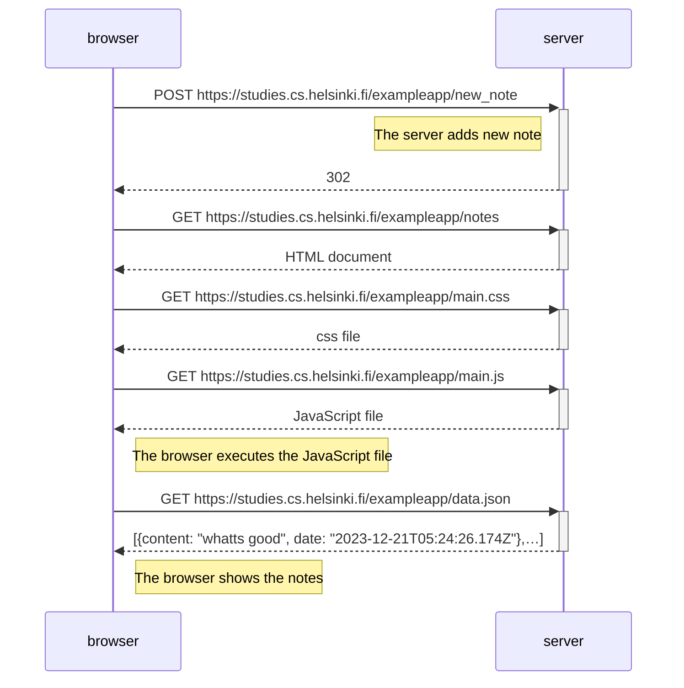

# 0.4: uusi muistiinpano

```mermaid
sequenceDiagram
    browser ->>+ server: POST https://studies.cs.helsinki.fi/exampleapp/new_note
    Note left of server: The server adds new note
    server -->>- browser: 302

    browser ->>+ server: GET https://studies.cs.helsinki.fi/exampleapp/notes
    server -->>- browser: HTML document
    browser ->>+ server: GET https://studies.cs.helsinki.fi/exampleapp/main.css
    server -->>- browser: css file
    browser ->>+ server: GET https://studies.cs.helsinki.fi/exampleapp/main.js
    server -->>- browser: JavaScript file
    
    Note right of browser: The browser executes the JavaScript file
    browser ->>+ server: GET https://studies.cs.helsinki.fi/exampleapp/data.json
    server -->>- browser: [{content: "whatts good", date: "2023-12-21T05:24:26.174Z"},…]
    Note right of browser: The browser shows the notes
```
